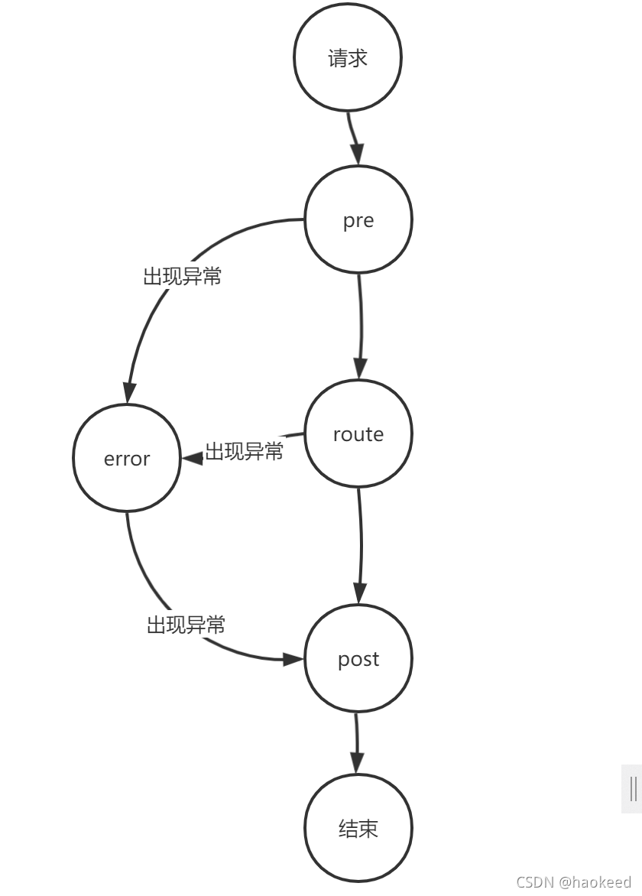

### eureka和nacos的区别
#### 部署方式
euraka是需要创建springboot项目，然后将euraka服务端通过gav的方式加载进来，然后部署项目。
> GAV方式‌在Maven中用于标识一个构件的唯一性，包括三个部分：groupId、artifactId和version。

nacos是直接从阿里巴巴nacos的官网下载jar包，启动服务。

#### zuul
网关组件，对标gateway，本质是通过**过滤器**实现的。
zuul框架提供了抽象类`ZuulFilter`用于继承，可以实现鉴权、监控、动态路由、压力测试等功能

##### 过滤器
过滤器共有4中类型

PRE： 这种过滤器在请求被路由之前调用。我们可利用这种过滤器实现身份验证、在集群中选择请求的微服务、记录调试信息等。

ROUTING： 这种过滤器将请求路由到微服务。这种过滤器用于构建发送给微服务的请求，并使用Apache HttpClient或Netfilx Ribbon请求微服务。

POST： 这种过滤器在路由到微服务以后执行。这种过滤器可用来为响应添加标准的HTTP Header、收集统计信息和指标、将响应从微服务发送给客户端等。

ERROR： 在其他阶段发生错误时执行该过滤器。

除了默认的过滤器类型，Zuul还允许我们创建自定义的过滤器类型。例如，我们可以定制一种STATIC类型的过滤器，直接在Zuul中生成响应，而不将请求转发到后端的微服务

##### 限流
zuul本身是没有提供限流的功能的,可以根据提供的filter自己去做限流，当然也可以使用经写好了的限流组件去集成,例如spring-cloud-zuul-ratelimit

